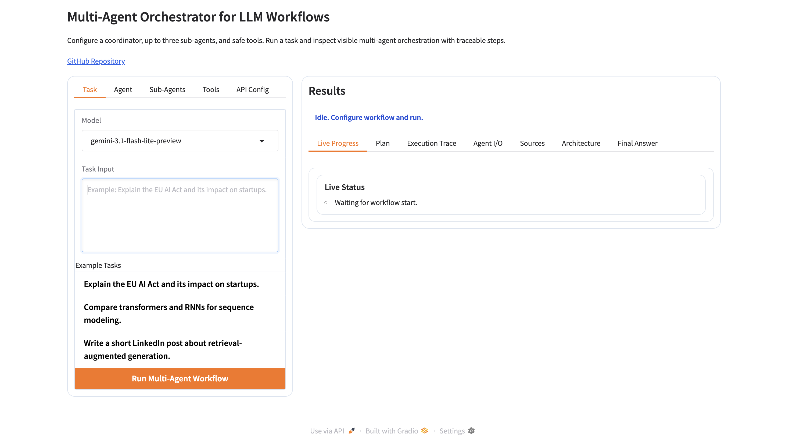
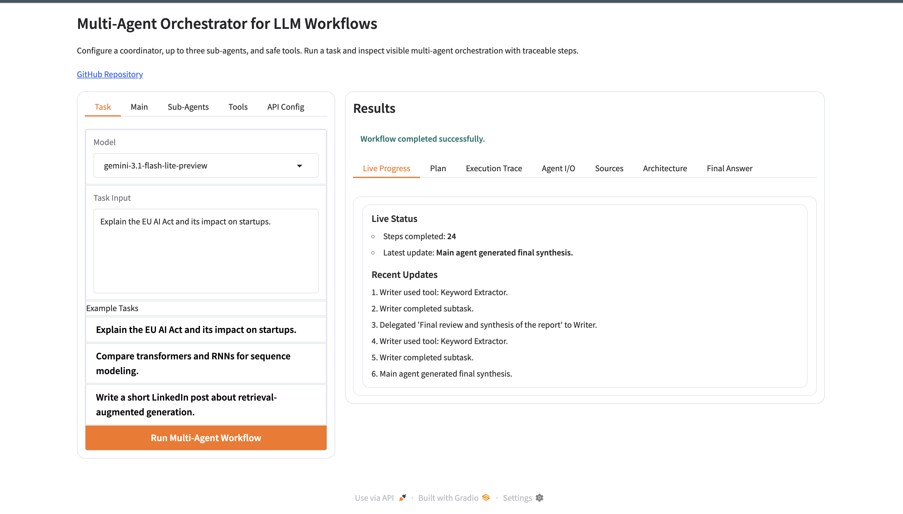
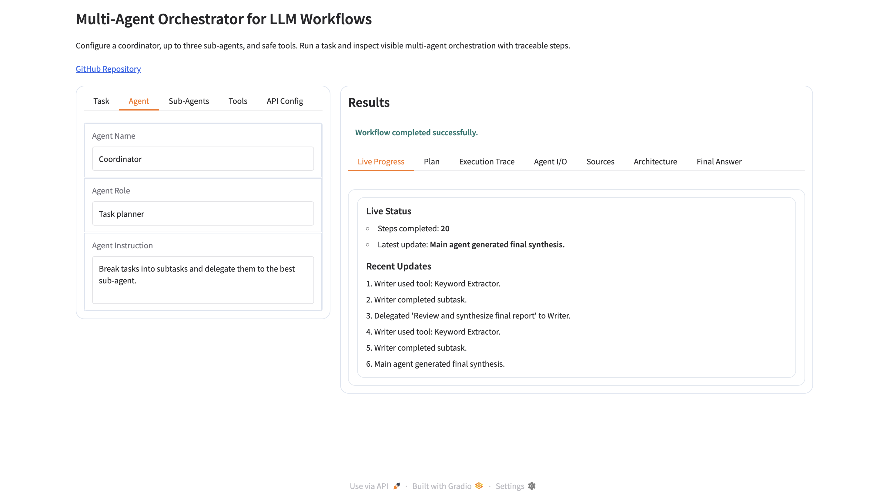
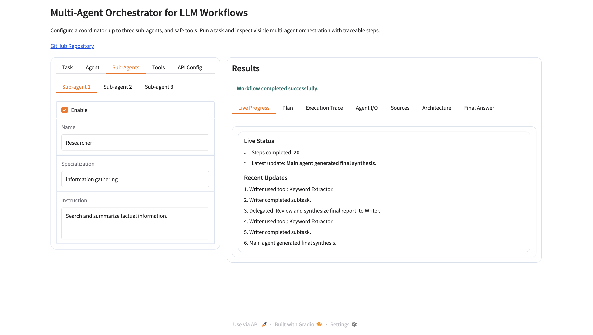
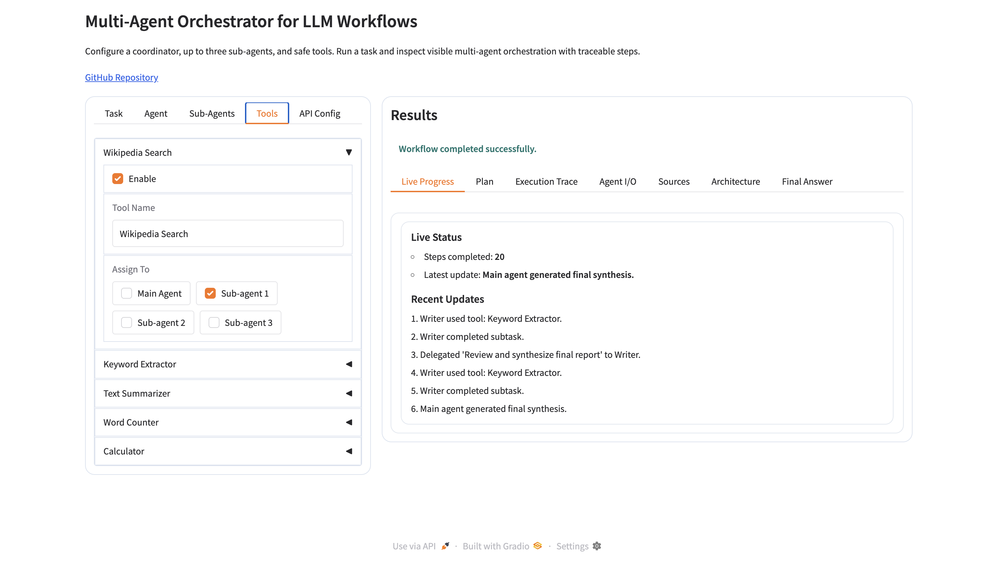
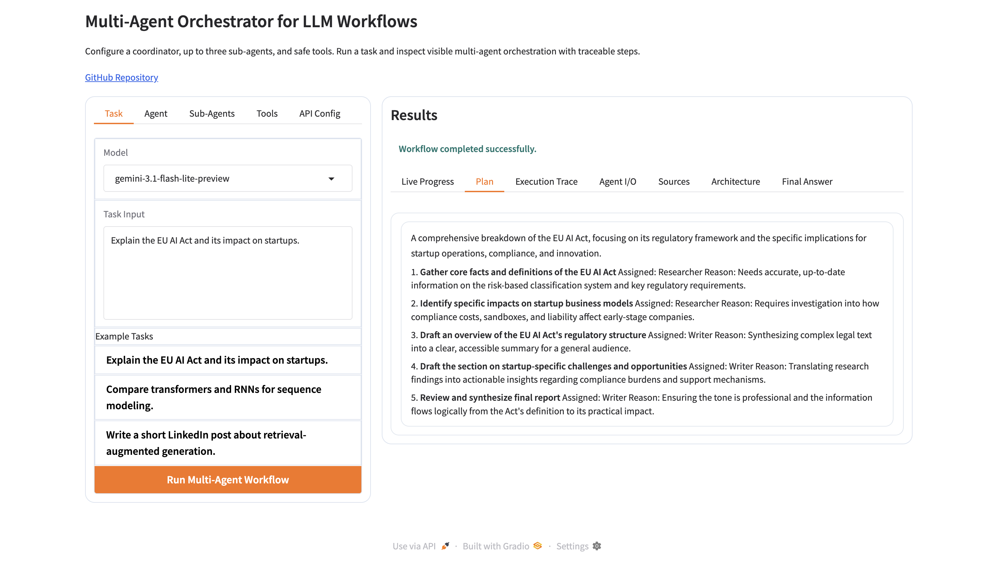
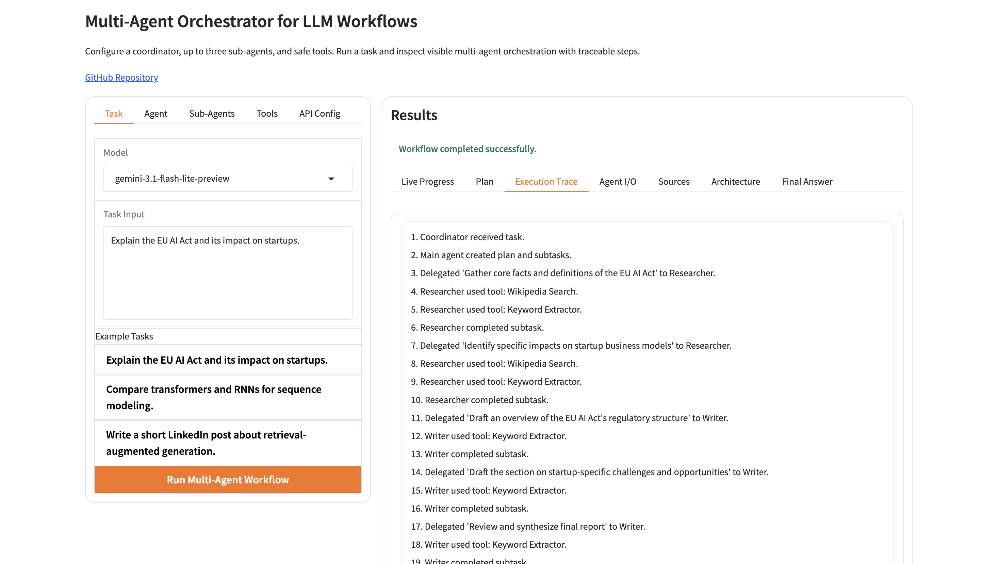
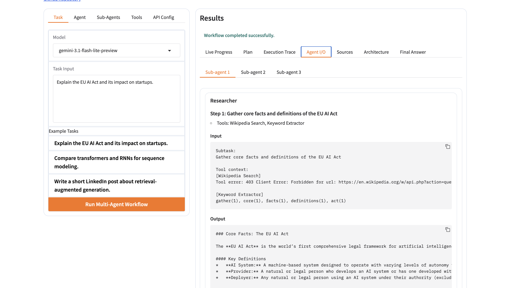
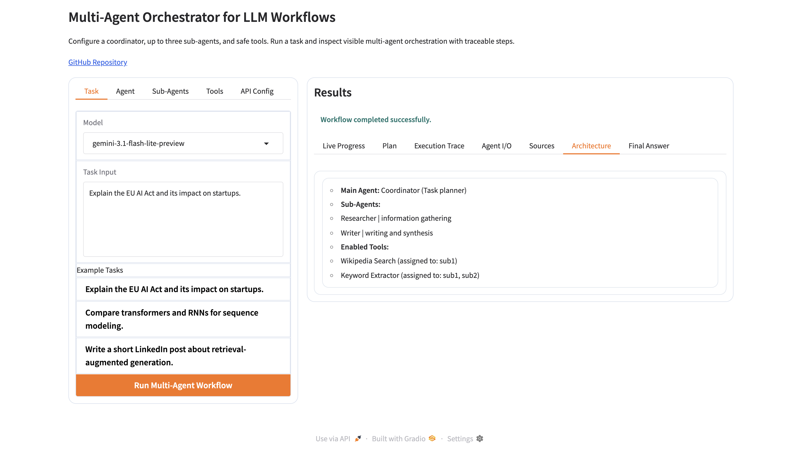
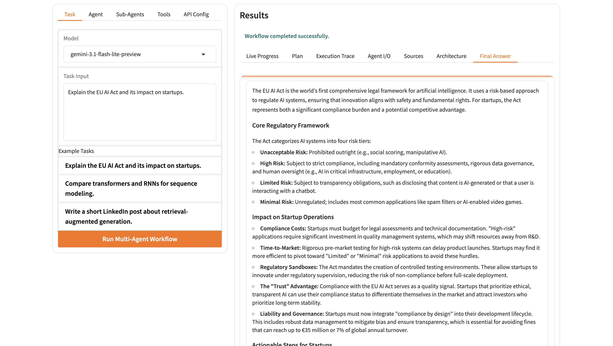

# Multi-Agent Orchestrator for LLM Workflows

## Demo Link (Hugging Face Live)

[Open Live Demo (Light Theme)](https://vtayyab6-multi-agent-orchestrator.hf.space/?__theme=light)

## Short Description

A Gradio application to configure a coordinator, sub-agents, and safe tools, then run a visible multi-agent workflow on Gemini with live progress, plan, execution trace, and final synthesized answer.

## Features

| Feature | Details |
|---|---|
| Workflow design in UI | Configure Task, Agent, Sub-Agents, Tools, and API Config from tabs |
| Multi-agent orchestration | 1 coordinator + up to 3 sub-agents with delegated subtasks |
| Safe tools | Wikipedia Search, Keyword Extractor, Text Summarizer, Word Counter, Calculator |
| Live execution visibility | Live status, plan, execution trace, agent I/O, sources, architecture |
| Model flexibility | Select Gemini model from dropdown (default: `gemini-3.1-flash-lite-preview`) |
| Final answer utility | Dedicated final answer tab with copy action |
| Secure key handling | API key entered in UI, used only for run-time requests, not stored |

## Screenshots (EU AI Act Example)

**1) Before running**


**2) Sample task input**


**3) Agent configuration**


**4) Sub-agent configuration**


**5) Tools configuration**


**6) Results - plan**


**7) Results - execution trace**


**8) Results - agent input/output**


**9) Results - architecture**


**10) Results - final answer**


## Project Structure

```text
multi-agent-orchestrator/
├── app.py
├── requirements.txt
├── README.md
├── screenshots/
│   ├── 01-before-running.png
│   ├── 02-sample-task-run.png
│   ├── 03-agent-tab.png
│   ├── 04-subagents-tab.png
│   ├── 05-tools-tab.png
│   ├── 06-results-plan-tab.png
│   ├── 07-results-execution-trace-tab.png
│   ├── 08-results-agent-io-tab.png
│   ├── 09-results-architecture-tab.png
│   └── 10-results-final-answer-tab.png
└── src/
    ├── __init__.py
    ├── config.py
    ├── agent_builder.py
    ├── gemini_client.py
    ├── orchestrator.py
    ├── tool_builder.py
    └── tools.py
```

## Local Setup

```bash
python3 -m venv .venv
source .venv/bin/activate
pip install -r requirements.txt
python app.py
```
